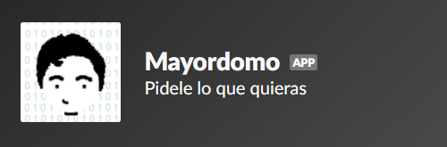

# Bot para Slack

El siguiente repo forma parte del curso de Celery de Platzi

## Como iniciar

Crea una app en Slack y configurala

https://api.slack.com/apps/new

Crea un entorno virtual y accede a el
```
python -m venv env
```

Instala los requirements
```
pip install -r requirements.txt
```

Crea un archivo de variables de entorno
.env

El archivo principal es:

`client.py`

## Funcionamiento

<div align="center">
  
</div>

# Licencia 
GNU GENERAL PUBLIC LICENSE Version 3
Código base: Juan Julián Merelo Guervós
https://github.com/JJ